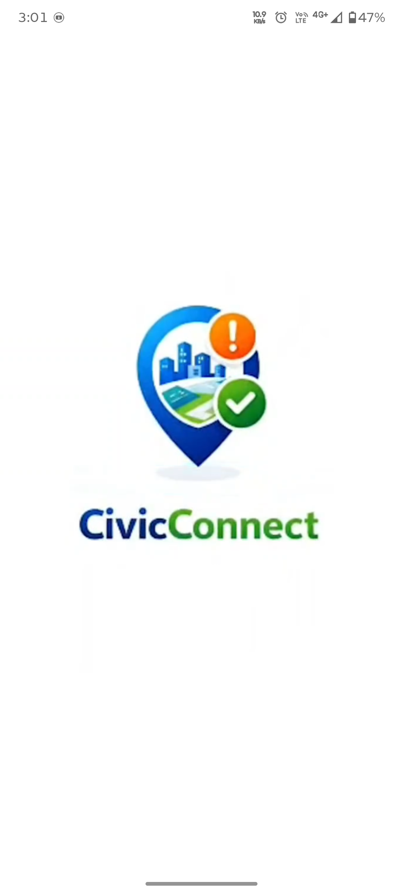
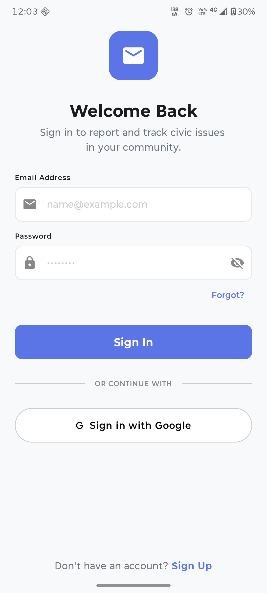
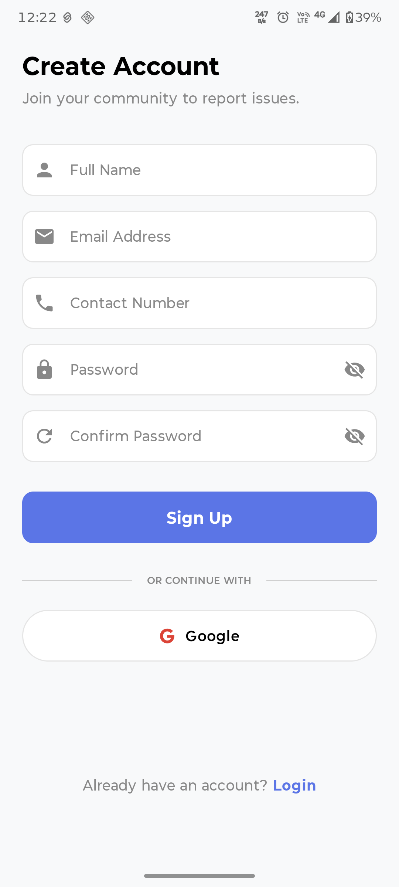
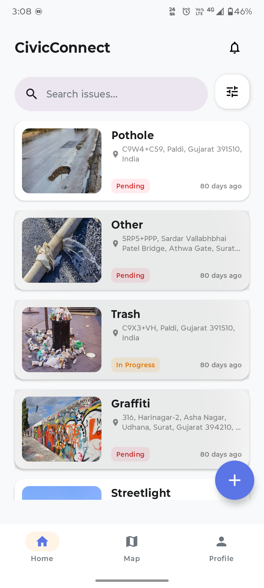
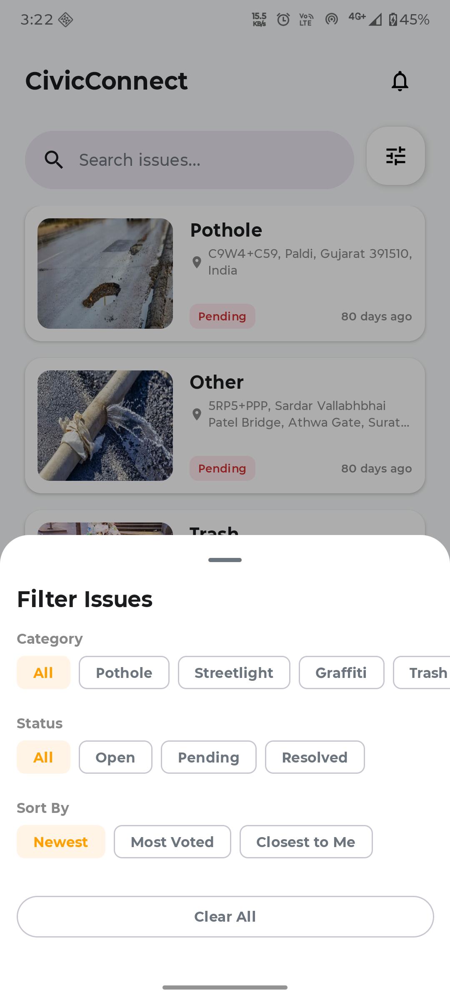
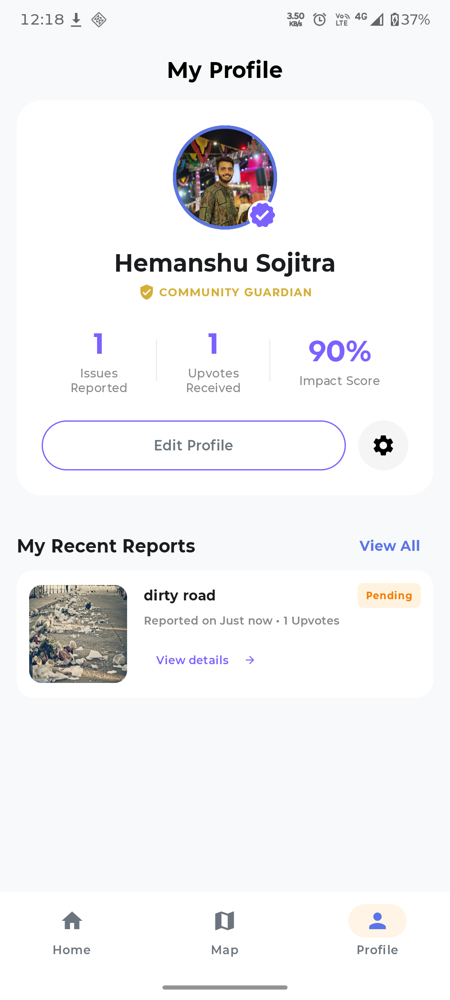

<div align="center">



<br/>

# CivicConnect AI

### Bridging citizens and local authorities — one report at a time

<p>
  
  
  
  
  
  
</p>

**CivicConnect AI** is a real-time, location-aware civic issue reporting platform that empowers citizens to report infrastructure problems — potholes, broken streetlights, water leaks, graffiti, and more — and connects them directly to local authorities for transparent, trackable resolution.

> 🌍 Domain: **Civic Tech / Social Impact** &nbsp;|&nbsp; 📱 Mobile App + 🖥️ Web Admin Panel

<br/>

[🚀 Getting Started](#-getting-started) • [✨ Features](#-features) • [📸 Screenshots](#-screenshots) • [🏗️ Architecture](#%EF%B8%8F-architecture) • [🛠️ Tech Stack](#%EF%B8%8F-tech-stack) • [🔐 Security](#-security)

</div>

---

## 🎯 How It Works

```
👤 Citizen spots an issue
        ↓
📸 Takes photo → App auto-captures GPS location via Google Maps API
        ↓
🗳️ Community upvotes/downvotes → Confidence score updates live on ALL devices
        ↓
🖥️ Admin panel triages → Assigns worker (e.g. "Assigned to: Sayyam")
        ↓
⚡ Firebase websocket fires → Compose UI animates instantly across all screens
        ↓
🔔 Node.js microservice → FCM push notification delivered to community
        ↓
✅ Issue resolved → Status updated, community notified in real-time
```

---

## ✨ Features

### 📱 Citizen Mobile App

| Feature | Description |
|---|---|
| 📍 **GPS Auto-Capture** | Precise location pinned automatically via Google Maps API on report submission |
| 📷 **Photo Reporting** | Upload images of civic issues — stored securely on Supabase |
| 🗳️ **Live Community Voting** | Upvote (Valid) / Downvote (Invalid) with confidence score updating across all devices instantly |
| 🗺️ **Interactive Issue Map** | Browse all reported issues on a live, explorable map |
| 🔍 **Smart Search & Filters** | Filter by category (Pothole, Trash, Streetlight, Graffiti…), status (Open / Pending / Resolved), and sort by Newest, Most Voted, or Closest to Me |
| 🔔 **Real-Time Push Notifications** | Instant alerts when an issue is assigned, updated, or resolved |
| 👤 **Community Guardian Profile** | Track your impact score, upvotes received, and all reports submitted |
| 🔐 **Auth** | Email/Password + Google Sign-In via Firebase Auth |

### 🖥️ Admin Web Panel

| Feature | Description |
|---|---|
| 📊 **Issue Dashboard** | Monitor all incoming reports with location, photo, and confidence score |
| 👷 **Worker Assignment** | Assign specific field workers to validated issues |
| 🔄 **Status Management** | Update issue status (Open → In Progress → Resolved) |
| 📈 **Community Confidence** | View real-time upvote/downvote ratios before triaging |

---

## 📸 Screenshots

<div align="center">

<table>
  <tr>
    <td align="center"><b>🌅 Splash</b></td>
    <td align="center"><b>🔐 Login</b></td>
    <td align="center"><b>📝 Sign Up</b></td>
  </tr>
  <tr>
    <td></td>
    <td></td>
    <td></td>
  </tr>
  <tr>
    <td align="center"><b>🏠 Home Feed</b></td>
    <td align="center"><b>🔍 Filter Panel</b></td>
    <td align="center"><b>👤 My Profile</b></td>
  </tr>
  <tr>
    <td></td>
    <td></td>
    <td></td>
  </tr>
</table>

</div>

---

## 🏗️ Architecture

```
┌─────────────────────────────────────────────────────┐
│                  CITIZEN ANDROID APP                 │
│         Kotlin + Jetpack Compose + MVVM             │
│   Google Maps API · Coil · mutableLongStateOf       │
└────────────────────┬────────────────────────────────┘
                     │ Firebase Websocket (real-time)
          ┌──────────▼──────────────┐
          │   FIREBASE REALTIME DB  │  ← Atomic multi-path transactions
          │  • Issues & votes       │     for concurrent vote integrity
          │  • Worker assignments   │
          │  • Status tracking      │
          └──────┬──────────┬───────┘
                 │          │
    ┌────────────▼──┐  ┌────▼──────────────────┐
    │  FIREBASE     │  │   SUPABASE STORAGE     │
    │  AUTH         │  │   User-uploaded        │
    │  Email/Google │  │   civic issue photos   │
    └───────────────┘  └────────────────────────┘
                 │
    ┌────────────▼───────────────────────────────┐
    │     NODE.JS MICROSERVICE (on Render)        │
    │  Event-driven · FCM multicast payloads      │
    │  Decoupled from core DB layer               │
    └────────────────────────────────────────────┘
                 │
    ┌────────────▼────────────────┐
    │  WEB ADMIN PANEL            │
    │  Issue triage & assignment  │
    └─────────────────────────────┘
```

---

## 🛠️ Tech Stack

### Android App

```
├── Language          →  Kotlin (100%)
├── UI Framework      →  Jetpack Compose (declarative, reactive)
├── Architecture      →  MVVM + Compose State Management
├── Real-Time UI      →  mutableLongStateOf + DisposableEffect
│                        (instant redraws without screen refresh)
├── Maps & Location   →  Google Maps API
│                        (Static Maps for speed + Interactive for explore)
└── Image Loading     →  Coil (async loading + caching)
```

### Backend & Services

```
├── Database          →  Firebase Realtime Database
│                        (instant reads/writes for votes & assignments)
├── Authentication    →  Firebase Auth (Email/Password + Google)
├── Storage           →  Supabase (civic issue photo hosting)
├── Push Notifications→  Firebase Cloud Messaging (FCM)
└── Notification      →  Node.js microservice on Render
    Microservice          (decoupled, event-driven FCM dispatcher)
```

### Build

```
└── Build System      →  Gradle (Kotlin DSL)
```

---

## ⚡ Engineering Highlights

### 1. Event-Driven Live UI
The Jetpack Compose frontend subscribes directly to Firebase websocket events. Community validation progress bars, worker assignment chips, and status badges **animate and update in real-time across every active device** — no polling, no page refresh.

```kotlin
// Real-time Firebase listener with Compose state
val voteCount = remember { mutableLongStateOf(0L) }

DisposableEffect(issueId) {
    val listener = database.child("issues/$issueId/votes")
        .addValueEventListener(object : ValueEventListener {
            override fun onDataChange(snapshot: DataSnapshot) {
                voteCount.longValue = snapshot.getValue(Long::class.java) ?: 0L
            }
            override fun onCancelled(error: DatabaseError) {}
        })
    onDispose { database.removeEventListener(listener) }
}
```

### 2. Atomic Multi-Path Transactions
Simultaneous community voting is protected by atomic multi-path database updates — **user vote records and global issue totals update in a single transaction**, preventing race conditions and data corruption.

### 3. Decoupled Notification Microservice
Instead of triggering FCM from inside the main app, a **dedicated Node.js service on Render** listens for database events and broadcasts high-priority push notifications. This keeps the notification pipeline independently scalable.

### 4. Custom Firebase Security Rules
Hand-engineered security rules enforce **strict role separation** — regular users can only read/vote on issues, while admin capabilities (worker assignment, status updates) are locked to verified admin UIDs. Atomic transactions are enforced at the rules layer.

---

## 🔐 Security

- 🔑 **Firebase Auth** — Unique user IDs map votes and reports, preventing duplicates
- 🛡️ **Custom Security Rules** — Role-based access control: citizens vs admins, strictly enforced
- 🔒 **Atomic Transactions** — Multi-path writes prevent vote manipulation during concurrent access
- 🚫 **No Admin Bypass** — Admin capabilities are inaccessible from the public mobile client

---

## 📁 Project Structure

```
CivicConnect_AI/
│
├── app/
│   └── src/
│       ├── main/
│       │   ├── java/
│       │   │   ├── screens/         # Compose screens (Home, Map, Profile, Detail)
│       │   │   ├── viewmodel/       # MVVM ViewModels with Firebase listeners
│       │   │   ├── model/           # Data classes (Issue, User, Vote, Status)
│       │   │   ├── repository/      # Firebase & Supabase data layer
│       │   │   ├── navigation/      # Compose navigation graph
│       │   │   └── notifications/   # FCM receiver & notification handling
│       │   ├── res/                 # Drawables, strings, themes
│       │   └── AndroidManifest.xml
│
├── build.gradle.kts
├── settings.gradle.kts
└── gradle.properties
```

---

## 🚀 Getting Started

### Prerequisites

- ✅ Android Studio (Hedgehog or later)
- ✅ JDK 11+
- ✅ A Firebase project (Realtime Database + Auth + FCM enabled)
- ✅ A Supabase project (for image storage)
- ✅ Google Maps API key
- ✅ Node.js (for the notification microservice)

### Installation

**1. Clone the repository**
```bash
git clone https://github.com/Hemanshu4949/CivicConnect_AI.git
cd CivicConnect_AI
```

**2. Firebase setup**
- Create a project at [console.firebase.google.com](https://console.firebase.google.com)
- Enable **Realtime Database**, **Authentication** (Email + Google), and **Cloud Messaging**
- Download `google-services.json` → place in `app/`

**3. Add your API keys**

Create `app/src/main/res/values/secrets.xml`:
```xml
<resources>
    <string name="google_maps_key">YOUR_GOOGLE_MAPS_API_KEY</string>
    <string name="supabase_url">YOUR_SUPABASE_URL</string>
    <string name="supabase_anon_key">YOUR_SUPABASE_ANON_KEY</string>
</resources>
```

**4. Notification microservice**
```bash
# In the /notification-service directory
npm install
# Set your Firebase service account key
node index.js
```

**5. Build & run**
```
Sync Gradle → Run on device or emulator
```

---

## 🗂️ Issue Categories

The app currently supports these civic issue categories:

`🕳️ Pothole` &nbsp; `💡 Streetlight` &nbsp; `🎨 Graffiti` &nbsp; `🗑️ Trash` &nbsp; `💧 Water Leak` &nbsp; `🚧 Other`

---

## 🔮 Future Scope

- 🤖 **AI-powered issue categorization** from submitted photos
- 📊 **Heatmap analytics** for city planners showing issue density by area
- ⏱️ **SLA tracking** — automatic escalation if issues exceed resolution time
- 🌐 **Multi-language support** for wider community reach
- ⌚ **Wearable integration** for quick one-tap reporting

---

## 🤝 Contributing

```bash
git checkout -b feature/your-feature-name
git commit -m "Add: your feature description"
git push origin feature/your-feature-name
# Open a Pull Request 🎉
```

---

## 👨‍💻 Author

**Hemanshu Sojitra** — [@Hemanshu4949](https://github.com/Hemanshu4949)

---

<div align="center">

⭐ If CivicConnect AI resonates with you, give it a star!

*Built with ❤️ for communities that deserve better infrastructure.*

`Kotlin` · `Jetpack Compose` · `Firebase` · `Supabase` · `Node.js` · `Google Maps`

</div>
